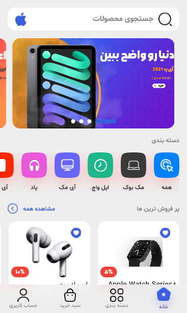
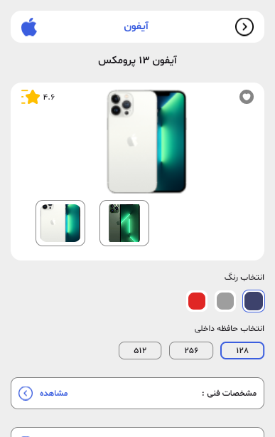

# 🍎 Apple Shop

> A modern Flutter-based e-commerce mobile application for browsing, discovering, and purchasing Apple products.

---

## 📱 Overview

**Apple Shop** is a Flutter-based e-commerce mobile application designed for browsing and purchasing Apple products through a modern and responsive mobile interface.

The application includes product discovery, category browsing, authentication, product details, comments, shopping cart management, online payment, and API-based data communication.

The project was built with a modular architecture that separates business logic, data access, repositories, and presentation layers.

---

## ✨ Features

### 🛍️ Shopping & Products

* Browse Apple products
* View product categories
* Explore products by category
* View detailed product information
* Display product images and variants
* Product properties and specifications
* Add products to shopping cart
* Manage cart items and quantities

### 🔐 Authentication

* User registration
* User login
* Authentication state management
* Persistent authentication token
* Logout functionality

### 💬 Comments

* View product comments
* Product-specific comment management
* API-based comment handling

### 💳 Payment

* Online payment integration
* ZarinPal payment gateway
* Payment handling and callback support

### 🔗 Additional Features

* REST API integration
* Network image caching
* Deep linking
* Local data persistence
* Loading animations
* Custom fonts and UI components
* Responsive Material Design interface

---

## 🛠️ Technologies & Packages

| Technology                     | Usage                                         |
| ------------------------------ | --------------------------------------------- |
| 🐦 **Flutter & Dart**          | Cross-platform mobile application development |
| 🔄 **BLoC / Flutter BLoC**     | State management and business logic           |
| 🌐 **Dio**                     | REST API and HTTP communication               |
| 🧩 **Dartz**                   | Functional error handling with `Either`       |
| 🔌 **GetIt**                   | Dependency injection                          |
| 💾 **Hive**                    | Local data storage                            |
| 🔐 **SharedPreferences**       | Local authentication/session data             |
| 💳 **ZarinPal**                | Online payment integration                    |
| 🔗 **Uni Links**               | Deep linking                                  |
| 🖼️ **Cached Network Image**   | Network image caching                         |
| 🔢 **Intl**                    | Number and date formatting                    |
| 🎨 **Material Design**         | Application UI                                |
| 🔤 **Gilroy / Shabnam / Dana** | Custom typography                             |

---

## 🏗️ Architecture

The application follows a modular structure that separates the main responsibilities of the application into different layers.

The general data flow is:

```text
┌───────────────┐
│   UI / Screens│
└───────┬───────┘
        ↓
┌───────────────┐
│     BLoC      │
│ State Manager │
└───────┬───────┘
        ↓
┌───────────────┐
│  Repository   │
└───────┬───────┘
        ↓
┌───────────────┐
│  Data Source  │
└───────┬───────┘
        ↓
┌───────────────┐
│   REST API    │
└───────────────┘
```

### 🔄 State Management

**BLoC** is used to separate business logic from the presentation layer.

The project contains dedicated BLoCs for major application features, including:

* Authentication
* Home
* Categories
* Category Products
* Products
* Product Comments
* Shopping Basket

### 🗂️ Data Layer

The data layer is divided into:

* **Data Sources** — API communication
* **Repositories** — Data abstraction and business-facing access
* **Models** — Application data structures

This structure makes the application easier to maintain and extend.

### 🔌 Dependency Injection

**GetIt** is used to register and provide application dependencies throughout the project.

---

## 📂 Project Structure

```text
lib/
├── bloc/
│   ├── authentication/
│   ├── basket/
│   ├── category/
│   ├── categoryProduct/
│   ├── comments/
│   ├── home/
│   └── product/
│
├── constants/
│
├── data/
│   ├── datasource/
│   ├── model/
│   └── repository/
│
├── di/
│   └── di.dart
│
├── screens/
│   ├── card_screen.dart
│   ├── category_screen.dart
│   ├── dashbord_screen.dart
│   ├── home_screen.dart
│   ├── login_screen.dart
│   ├── product_detail_screen.dart
│   ├── product_list_screen.dart
│   ├── profile_screen.dart
│   └── register_screen.dart
│
├── util/
│   ├── api_exeption.dart
│   ├── auth_manager.dart
│   ├── dio_provider.dart
│   ├── payment_handler.dart
│   ├── url_handler.dart
│   └── extentions/
│
└── widgets/
    ├── banner_slider.dart
    ├── cached_image.dart
    ├── category_icon_item_chip.dart
    ├── loading_animation.dart
    └── product_item.dart
```

---

## 📸 Screenshots

<div align="center">

<table>
<tr>
<td align="center">

### 🏠 Home



</td>

<td align="center">

### 🛍️ Products


</td>
</tr>

<tr>
<td align="center">

### 📦 Product Details



</td>

<td align="center">

### 🛒 Shopping Cart


</td>
</tr>
</table>

</div>

---

## 🌐 API Integration

The application communicates with backend services through REST APIs.

**Dio** is used as the HTTP client, while dedicated data sources and repositories handle communication and data access.

The API layer is responsible for features such as:

* Authentication
* Product data
* Categories
* Product details
* Product variants
* Shopping basket
* Comments
* Product images

---

## 💾 Local Storage

The application uses **Hive** for local data persistence.

The shopping basket is stored locally using Hive, allowing cart data to remain available between application sessions.

**SharedPreferences** is also used for storing authentication-related local data.

---

## 💳 Online Payment

The project integrates the **ZarinPal** payment gateway to provide online payment functionality.

Payment-related logic is separated into a dedicated utility layer to keep payment handling independent from the main UI components.

---

## 🔗 Deep Linking

The application includes deep linking functionality using **Uni Links**.

This allows the application to handle links and navigate users to specific application flows.

---

## 🎨 UI & Design

The application uses a custom visual system with:

* Material Design
* Custom color definitions
* Custom typography
* Gilroy fonts
* Shabnam fonts
* Dana font
* Reusable UI components
* Product cards
* Category chips
* Banner slider
* Loading animations
* Cached network images

---

## 🚀 Getting Started

### Prerequisites

Make sure you have the following installed:

* Flutter SDK
* Dart SDK
* Android Studio or VS Code
* Git

### Installation

Clone the repository:

```bash
git clone https://github.com/MobinaFetrati/apple_shop-flutter.git
```

Navigate to the project directory:

```bash
cd apple_shop-flutter
```

Install dependencies:

```bash
flutter pub get
```

Run the application:

```bash
flutter run
```

---

## 📱 Supported Platforms

The application is built with Flutter and can be configured for:

* 🤖 Android
* 🍎 iOS

---

## 🎯 Project Purpose

Apple Shop was developed to demonstrate the implementation of a real-world e-commerce mobile application using Flutter.

The project focuses on:

* Modular application architecture
* BLoC state management
* REST API integration
* Authentication
* Product and category management
* Shopping cart functionality
* Local data persistence
* Online payment
* Deep linking
* Reusable UI components

---

## 👩‍💻 Developer

**Mobina Fetrati**

Flutter Developer | Mobile Application Developer

🔗 GitHub: [MobinaFetrati](https://github.com/MobinaFetrati)
